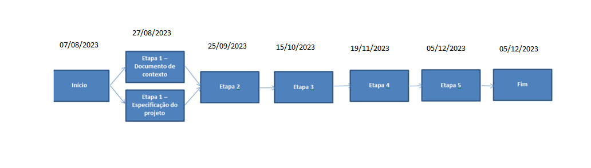
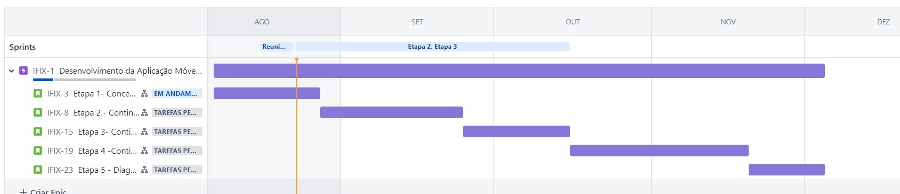

# Especificações do Projeto

1. **Objetivo Alvo**: Desenvolver uma aplicação móvel para dispositivos iOS (iPhone e iPad) que ofereça um canal de assistência de manutenção e reparo de produtos da Apple.

2. **Funcionalidades principais**:

   | Cod | Funcionalidade                             | Descrição                                                                                                                                                                           |
   | --- | ------------------------------------------ | ----------------------------------------------------------------------------------------------------------------------------------------------------------------------------------- |
   | 1   | Cadastro de usuários e produtos Apple.     | Permitir que os usuários se cadastrem na plataforma usando informações básicas, como nome, e-mail e senha.                                                                          |
   | 2   | Solicitação de assistência técnica.        | Oferecer um formulário de solicitação de assistência técnica, onde os usuários podem descrever brevemente o problema que estão enfrentando com seu dispositivo Apple.               |
   | 3   | Acompanhamento do status de reparo.        | Após a solicitação, os usuários podem verificar o status do reparo através de uma página de acompanhamento simples.                                                                 |
   | 4   | Notificações sobre atualizações no status. | Enviar notificações por e-mail ou mensagem SMS quando houver uma atualização significativa no status do reparo.                                                                     |
   | 5   | Acesso a guias de solução de problemas.    | Disponibilizar algumas guias básicas de solução de problemas para problemas comuns que os usuários possam enfrentar, como reinicialização de dispositivo, problemas de conexão etc. |
   | 6   | Avaliação e feedback pós-reparo.           | Após o reparo ser concluído, permitir que os usuários forneçam feedback sobre a qualidade do serviço.                                                                               |

## Personas

As personas levantadas durante o processo de entendimento do problema são apresentadas na Tabela que se seguem.

| Cod | Tipo do Usuário               | Descrição                                                                                                                                                                                     |
| --- | ----------------------------- | --------------------------------------------------------------------------------------------------------------------------------------------------------------------------------------------- |
| 1   | Usuário Leigo                 | Uma pessoa não técnico que possui um iPhone, mas tem dificuldades em lidar com problemas técnicos. Ele busca uma solução fácil para receber ajuda quando seu dispositivo apresenta problemas. |
| 2   | Técnico com Certificado Apple | Um profissional que deseja usar a plataforma para acessar manuais de reparo e obter informações técnicas detalhadas sobre produtos Apple, para melhor atender seus clientes.                  |
| 3   | Estudante Universitário       | Um estudante que possui um MacBook e depende muito dele para suas tarefas acadêmicas. Ele relata que procura uma maneira rápida de obter assistência em caso de falhas.                       |
| 4   | Cliente Fiel Apple            | Um entusiasta da Apple com vários produtos da marca, busca uma plataforma unificada para gerenciar seus dispositivos e receber suporte quando necessário.                                     |
| 5   | Usuário Empresarial           | Uma pequena empresa que utiliza dispositivos Apple em sua operação diária, ele precisa de um canal eficiente para agendar reparos e minimizar a interrupção nas atividades comerciais.        |

## Histórias de Usuários

A partir da compreensão do dia a dia das personas identificadas para o projeto, foram registradas as seguintes histórias de usuários.

| EU COMO... `PERSONA`      | QUERO/PRECISO ... `FUNCIONALIDADE`                               | PARA ... `MOTIVO/VALOR`                                                    |
| ------------------------- | ---------------------------------------------------------------- | -------------------------------------------------------------------------- |
| Usuário Leigo             | relatar problemas com meu iPhone                                 | receber instruções simples e obter assistência técnica de maneira fácil.   |
| Técnico Certificado Apple | acessar manuais de reparo detalhados para produtos Apple         | executar reparos com mais eficácia e precisão.                             |
| Estudante Universitário   | agendar reparos rápidos para o meu MacBook                       | evitar interrupções em minhas atividades acadêmicas e continuar produtivo. |
| Cliente Fiel Apple        | receber notificações sobre o status do reparo do meu dispositivo | ficar atualizado sobre o progresso e estimativas de conclusão.             |
| Usuário Empresarial       | um canal eficiente para agendar reparos                          | minimizar a interrupção nas atividades comerciais                          |

## Especificações em Matriz de rastreabilidade

| Necessidade/Requisito            | Funcionalidade/Atividade                         | Evidência                               |
| -------------------------------- | ------------------------------------------------ | --------------------------------------- |
| Acompanhamento de reparos        | Desenvolvimento do aplicativo móvel              | Aplicativo móvel em funcionamento       |
| Comunicação clara sobre status   | Implementar atualizações de status em tempo real | Status atualizado visível no aplicativo |
| Redução de ligações/mensagens    | Integrar notificações de status por push         | Notificações enviadas e recebidas       |
| Cadastro de usuários             | Criar sistema de registro e login                | Cadastro e login funcionais             |
| Informar tipo de reparo e prazo  | Mostrar detalhes do serviço e prazo de conclusão | Informações corretas exibidas           |
| Indicação de conclusão de reparo | Atualização do status para "Concluído"           | Mudança de status visível               |
| Melhorar reputação da empresa    | Coletar avaliações dos clientes                  | Avaliações positivas recebidas          |
| Fidelização do cliente           | Implementar programas de fidelidade              | Benefícios para usuários fiéis          |

## Gerenciamento de Tempo

Segundo Vargas (2018), o gerenciamento do cronograma tem como principal objetivo garantir que o projeto seja concluído dentro do prazo determinado.

Com diagramas bem organizados, que permitem gerenciar o tempo nos projetos, o gerente de projetos agenda e coordena tarefas dentro de um projeto para estimar o tempo necessário de conclusão.

Para construir um bom diagrama, deve-se partir de um conjunto de atividades definidas, sequenciando-as de acordo com as dependências conhecidas entre si, estimando as durações das atividades individualmente e desenvolvendo a estrutura do projeto, em termos das tarefas e suas interações. É preciso, ademais, definir uma abordagem de ciclo de vida mais adequada ao projeto em questão.

O diagrama de rede pode ser entendido como um gráfico que mostra as tarefas que precisam ser realizadas para a finalização de um projeto. Além de mostrar as relações contínuas de atividades, mostra como fazer as atividades e o cronograma determina quando fazer as tarefas do projeto.

A seguir, encontra-se o diagrama de redes do projeto Ifix.

O gráfico de Gantt, ou diagrama de Gantt, também é uma ferramenta visual utilizada para controlar e gerenciar o cronograma de atividades de um projeto. Com ele, é possível listar tudo que precisa ser feito para colocar o projeto em prática, dividir em atividades e estimar o tempo necessário para executá-las.
A seguir, encontra-se o diagrama de Gantt do projeto Ifix, utilizado como ferramenta de gerenciamento do cronograma do projeto.

## Gerenciamento de Equipe

O gerenciamento adequado de tarefas contribuirá para que o projeto alcance altos níveis de produtividade. Por isso, é fundamental que ocorra a gestão de tarefas e de pessoas, de modo que os times envolvidos no projeto possam ser facilmente gerenciados.

A Gestão do Código Fonte e a Divisão de Papéis da equipe, bem como o ambiente utilizado para o gerenciamento de recursos, encontram-se detalhados no tópico de Metodologia.

A seguir, é descrito o planejamento que auxiliará e direcionará a gestão de recursos durante o projeto.

>**Planejar o gerenciamento de recursos**
-	Planejar como será feita a gestão de recursos do projeto;
-	Consultar opinião especializada sobre esse tipo de projeto;
-	Obter documentações necessárias para o desenvolvimento do projeto;
-	Atribuir funções às pessoas da equipe;
-	Planejar o cronograma de trabalho.

>**Estimar os recursos das atividades**
-	Analisar quais os recursos necessários para realização das atividades e quantificar;
-	Recursos humanos: desenvolvedores e gestores do projeto;
-	Recursos materiais: seis computadores com editores de código fonte instalados;
-	Acesso ao Figma;
-	Aulas PUC-Minas.

>**Adquirir recursos**
-	Acesso às aulas da PUC Minas via matrícula de alunos;
-	Acesso ao figma por contas vinculadas (gmail);
-	Alunos e componentes do projeto atuam como desenvolvedores e gestores;
-	Utilização de computadores dos alunos do projeto.

>**Desenvolver a equipe**
-	Treinamento da equipe em React Native;
-	Treinamento da equipe em gerenciamento de projetos;
-	Treinamento na utilização do Figma;
-	Soft skills.

>**Gerenciar a equipe**
-	Atualizar a documentação;
-	Atualizar outros fatores que podem influenciar no desenvolvimento do projeto;
-	Planejamento por entregas;
-	Atualização do plano de gerenciamento do projeto.

>**Controlar os recursos**
-	Informações sobre o desempenho e andamento do trabalho;
-	Atualizações sobre o plano de gerenciamento de recursos.

## Gestão de Orçamento

| Orçamento                     |     (R$)         |
| ----------------------------- | ------------ |
| **Recursos Humanos**            | **150,000** |
|   - Gerente de Projeto (4 meses)  | 12,000  |
|   - Desenvolvedor (6 meses) x 5   | 138,000 |
| **Hardware**                    | **15,000**  |
|   - Computadores e Equipamentos   | 10,000  |
|   - Dispositivos Móveis           | 5,000   |
| **Rede**                        |  **5,000**   |
|   - Equipamentos de Rede          | 3,000   |
|   - Instalação e Configuração     | 2,000   |
|  **Software**                    | **10,000**  |
|   - Licenças de Software          | 8,000   |
|   - Ferramentas de Desenvolvimento | 2,000  |
|  **Serviços**                     | **8,000**  |
|   - Consultoria Externa           | 5,000   |
|   - Suporte Técnico               | 3,000   |
| **Total**                       | **196,000** |

Detalhes para cada item:

- Recursos Humanos:
   - Gerente de Projeto (4 meses): O Gerente de Projeto receberá R$ 12,000 pelo período de 4 meses.
   - Desenvolvedores (6 meses) x 5: Cada um dos 5 desenvolvedores receberá R$ 23,000 (totalizando R$ 115,000) pelo período de 6 meses.

- Hardware:
   - Computadores e Equipamentos: O custo de hardware é de R$ 10,000 para adquirir computadores e outros equipamentos necessários.
   - Dispositivos Móveis: R$ 5,000 para dispositivos móveis necessários para o desenvolvimento e teste.

- Rede:
   - Equipamentos de Rede: Os equipamentos de rede têm um custo de R$ 3,000.
   - Instalação e Configuração: A instalação e configuração da rede têm um custo de R$ 2,000.

- Software:
   - Licenças de Software: R$ 8,000 para adquirir as licenças de software necessárias para o desenvolvimento.
   - Ferramentas de Desenvolvimento: R$ 2,000 para adquirir ferramentas específicas de desenvolvimento.

- Serviços:
   - Consultoria Externa: Custa R$ 5,000 para contratar serviços de consultoria externa.
   - Suporte Técnico: R$ 3,000 para serviços de suporte técnico ao longo do projeto.
