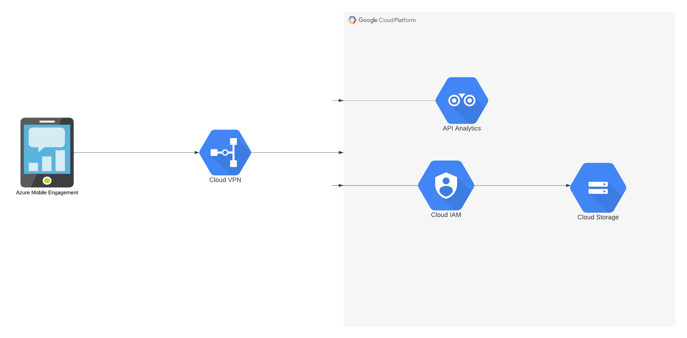
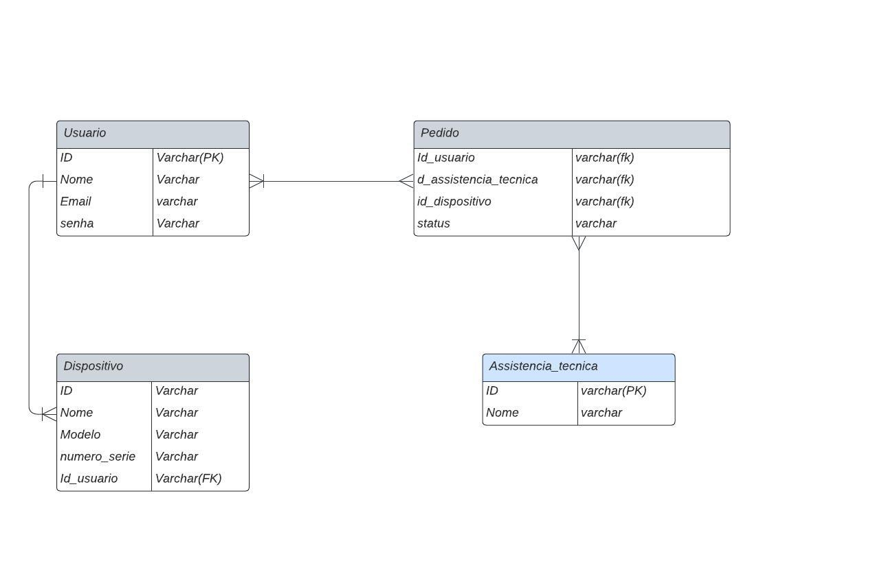

# Arquitetura da Solução

Pré-requisitos: <a href="3-Projeto de Interface.md"> Projeto de Interface</a>

Definição de como o software é estruturado em termos dos componentes que fazem parte da solução e do ambiente de hospedagem da aplicação.

Firebase já estará na cloud da Google. 

## Diagrama de Classes

Em aberto pois o back-end será todo do firebase então não iremos contruir o back-end

## Modelo ER

## Esquema Relacional

O Esquema Relacional corresponde à representação dos dados em tabelas juntamente com as restrições de integridade e chave primária.
 
As referências abaixo irão auxiliá-lo na geração do artefato “Esquema Relacional”.

> - [Criando um modelo relacional - Documentação da IBM](https://www.ibm.com/docs/pt-br/cognos-analytics/10.2.2?topic=designer-creating-relational-model)

## Modelo Físico

O Firebase Realtime Database é um banco de dados NoSQL hospedado na nuvem e não requer scripts de criação de banco de dados como em sistemas de gerenciamento de banco de dados SQL tradicionais. Em vez disso, você define a estrutura de seus dados diretamente por meio do código do aplicativo ou usando a interface do Firebase Console.

## Tecnologias Utilizadas

- Javascript
- React Native
- Firebase (como back-end)

## Hospedagem

- Sera hospedadod em ...

## Qualidade de Software

Será realizados testes e verificar se cada funcionalidade atendo os requisitos pré definidos.
