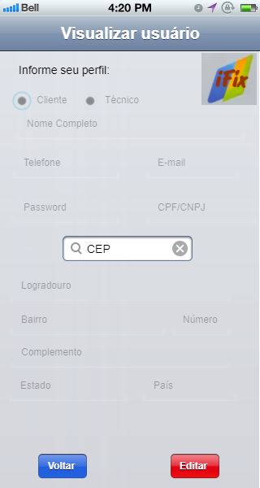
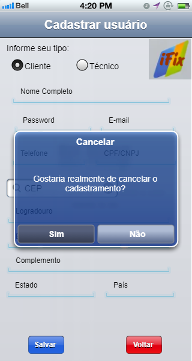
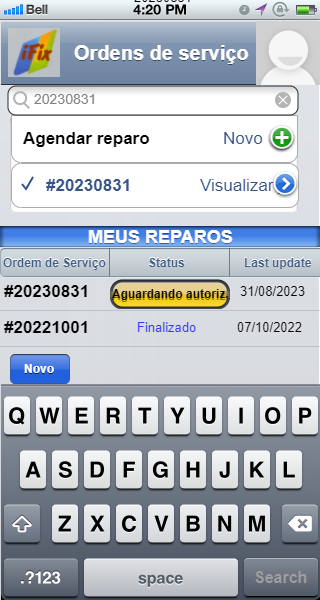
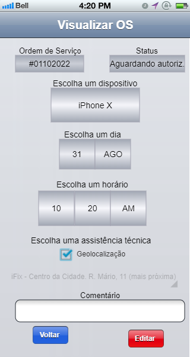
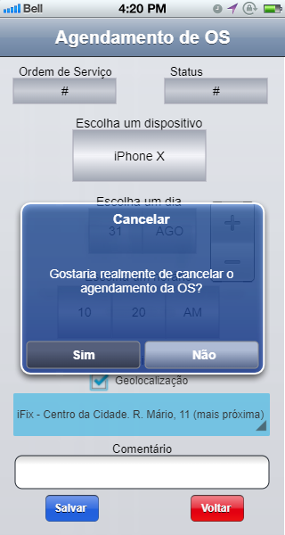
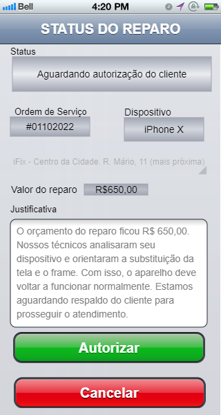
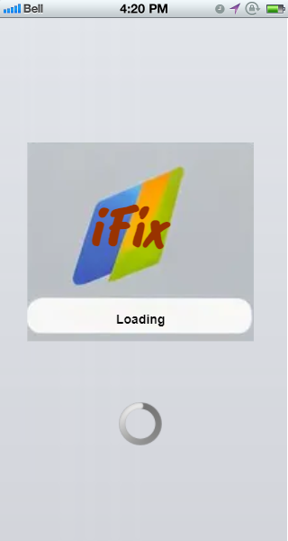
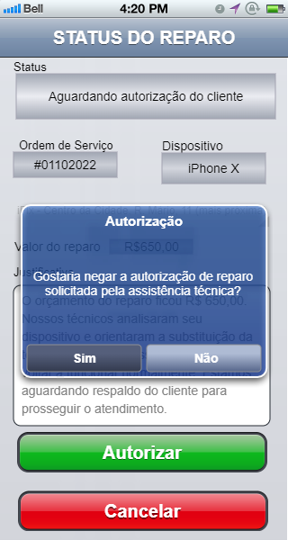

# Programação de Funcionalidades

Pré-requisitos: <a href="../docs/02-Especificação do Projeto.md"> Especificação do Projeto</a>, <a href="../docs/04-Projeto de Interface.md"> Projeto de Interface</a>, <a href="../docs/03-Metodologia.md"> Metodologia</a>, <a href="../docs/05-Arquitetura da Solução.md"> Arquitetura da Solução</a>

Implementação do sistema descritas por meio dos requisitos funcionais e/ou não funcionais. Deve relacionar os requisitos atendidos os artefatos criados (código fonte) além das estruturas de dados utilizadas e as instruções para acesso e verificação da implementação que deve estar funcional no ambiente de hospedagem.

Para cada requisito funcional, pode ser entregue um artefato desse tipo

# Instruções de Acesso

Para acessar iFix basta <!--executar o comando npm install e npm start na pasta iFix e--> ler o qr code no aplicativo Expo Go. Demais instruções estão no código.

# Evolução do projeto

**Felipe**
Responsável por implementar as telas de Login e cadastro 
> - Login: o usuário tem a opção de logar, registrar (cadastrar-se como proprietário ou técnico) e recuperação de senha
> - cadastro: o usuário tem a opção de cadastrar-se como cliente ou técnico, além de editar e poder visualizar seus dados

    

**Taciana**
Responsável por implementar as telas Homescreen (página inicial), ChangeData (alteração de dados pessoais), Adddevices (cadastrar dispositivos), MaintenancesDone (cadastrar manutenções realizadas) e RegisterService (cadastrar serviço realizado). Também foi responsável pelo desenvolvimento das rotas da aplicação e de alguns componentes, como os botões e o navbar.

> - Homescreen: o usuário encontra meu perfil, agendar serviços, para clientes e para técnicos.
> - ChangeData: o usuário pode alterar seus dados - a tela foi mesclada em PersonalInformation, para diminuir o fluxo de cliques.
> - Adddevices: o usuário realiza o cadastro de seus dispositivos.
> - MaintenancesDone: o usuário realiza o cadastro de suas manutenções realizadas. 
> - Register Service: o usuário/técnico realiza o cadastro de serviços prestados. 

    

**Jeosefa**
Responsável por implementar implementar o crud e também foi responsável pelo desenvolvimento das rotas da aplicação e de alguns componentes, como os botões e o navbar.
- responsável por implementar também o crud da tela de login, cadastro e edicao do usuário e também e manutenções. 
- responsável por implementar o crud da tela de manuntencao, agendamento e cadastro de dispositivos.

    

**Don**
Responsável por implementar o crud também e o Banco de dados no sistema Também foi responsável pelo desenvolvimento das rotas da aplicação e de alguns componentes, como os botões e o navbar.

  

**Gustavo**
Responsável por implementar o crud, listar e também implementar alguns componentes

   

> **Links Úteis**:
>
> - [Trabalhando com HTML5 Local Storage e JSON](https://www.devmedia.com.br/trabalhando-com-html5-local-storage-e-json/29045)
> - [JSON Tutorial](https://www.w3resource.com/JSON)
> - [JSON Data Set Sample](https://opensource.adobe.com/Spry/samples/data_region/JSONDataSetSample.html)
> - [JSON - Introduction (W3Schools)](https://www.w3schools.com/js/js_json_intro.asp)
> - [JSON Tutorial (TutorialsPoint)](https://www.tutorialspoint.com/json/index.htm)